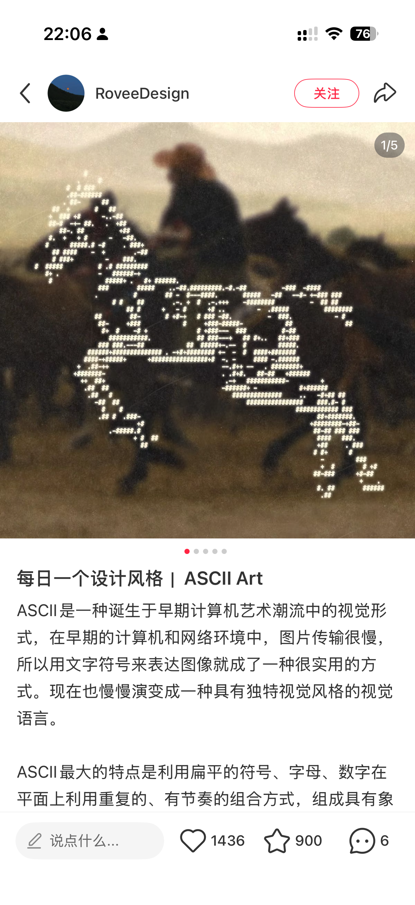
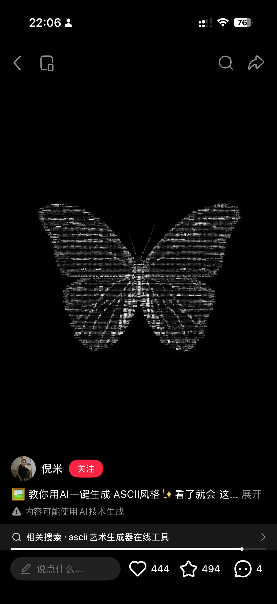
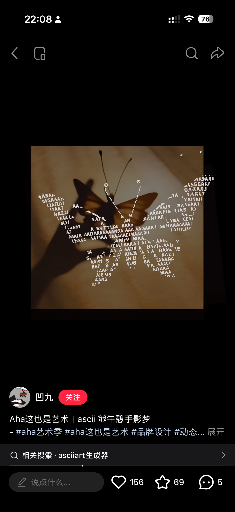
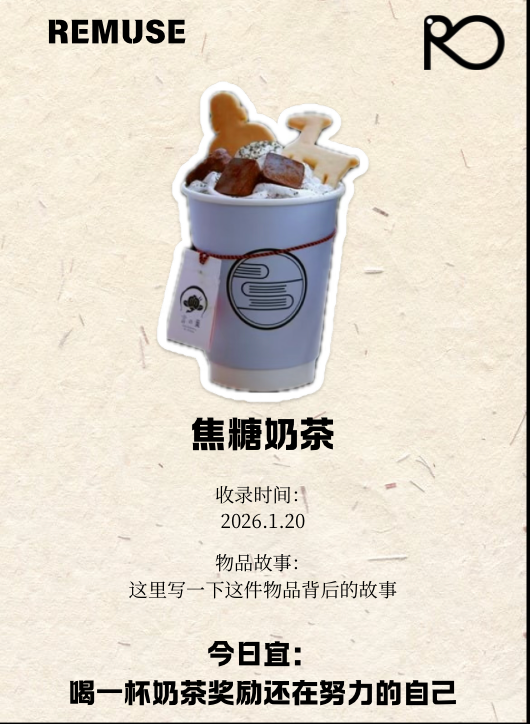
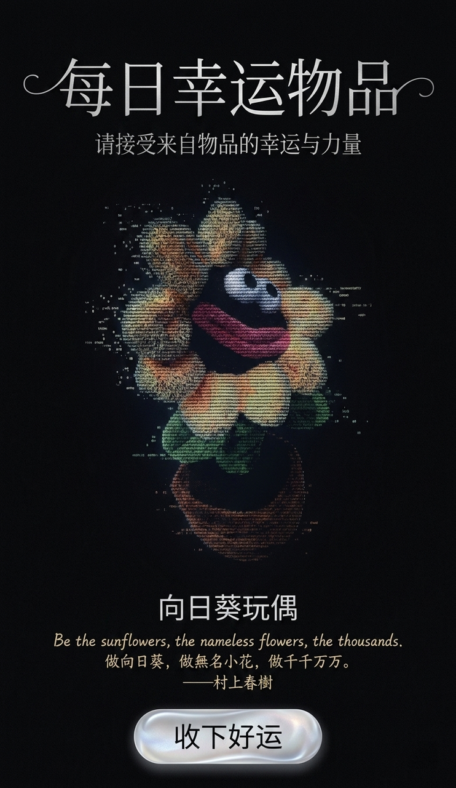
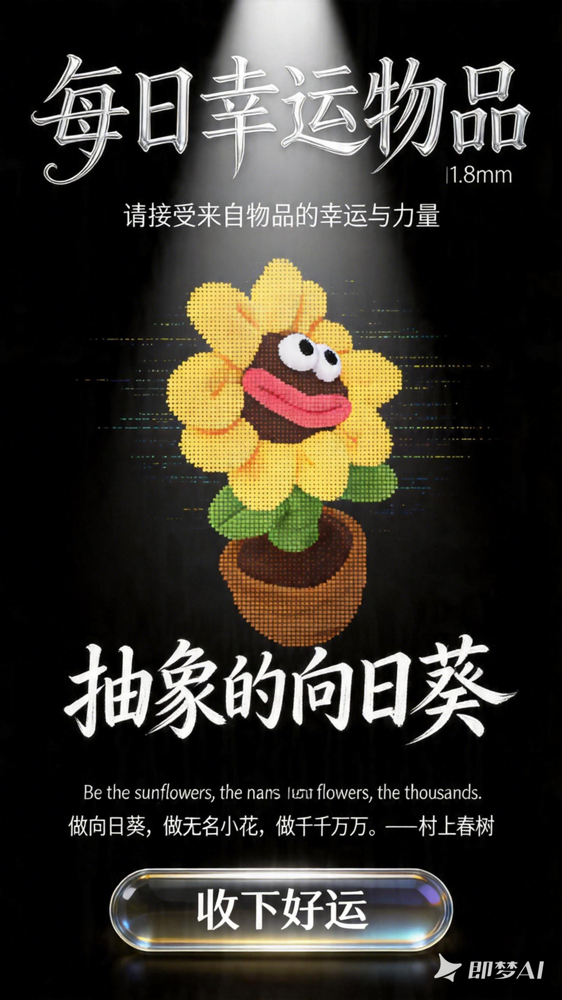
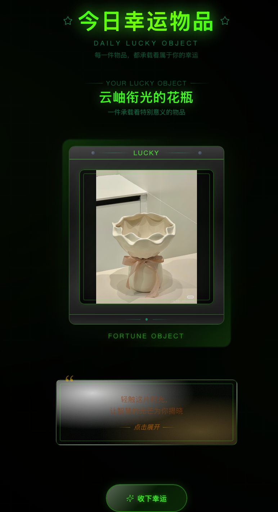
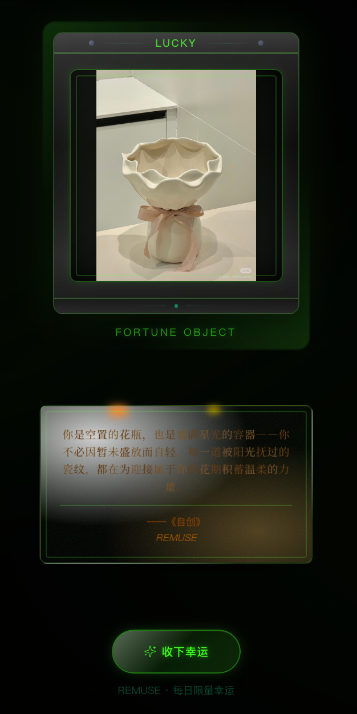

交互设计
- 今日幸运物品功能需要集成到产品网站中，用户碰一碰NFC后会直接跳转到产品中的今日幸运物品界面。
- 可以提前内置几个物品，和用户上传的物品一起作为数据库，随机选择一个物品作为今天的幸运好物
- 物品下方设计一个交互的界面，可以做成复古纸张的样式，显示“光落此页，等你开启”。点击后纸张出现被点燃的视觉效果或扩散的效果，然后逐渐显现出文字。
- 最下方是按键“收下好运”，点击后出现动画效果。
- 在产品主页面加一个状态栏，可以显示今天日期，幸运好物的缩略图，幸运好物的名称。
页面设计
- 包含3个主体部分：标题、物品卡、文案
- 标题“每日幸运物品”，副标题“请接受来自物品的幸运与力量”
- 物品卡：从物品库中随机选择一件物品做一个区别于藏品库的视觉效果，最好用户可以进行交互，我想了3种设计方式，以下根据难度排列：
1. 3D效果：可以先将物品风格化后转成3D模型，放置在一个透明水晶球里（这个如果比较难可以先不做），用户可以旋转查看
2. ASCII风格：有网址可以直接转化，我感觉应该也有对应的代码，你可以找找看，大约是这样的风格

3. 复古卡片风格：

- 文案：位于卡片或图片下方，需要有交互效果，我设想的是做成纸张燃烧出现文字的效果，可以用p5js来实现，我找了几个教程：
燃烧的情书 ——文字完成了它的使命：抵达你。 火焰完... http://xhslink.com/o/3wNXMETbGRJ 
先复制这段口令，再去【小红书】打开笔记~
p5js交互｜烧开回忆的信件 用p5js做了个“烧开回忆信... http://xhslink.com/o/6NiZCTf7Xo0 
这篇笔记在【小红书】等你来读~
关于文案的选择：
首先需要根据物品的类型从现有的文学作品中搜索与该物品相关的且充满积极意义、希望、鼓励等态度的话语。如果是英文作品需要同时展现中英文，同时需要附上出自什么文学作品以及对应的作者。如果找不到对应的文学作品则可以自行创造一段积极优美且充满艺术感的话，文字出处可以统一写出“REMUSE”。
例如下面我在做的时候上传了一个向日葵玩偶，于是下方的文案则是：Be the sunflowers, the nameless flowers, the thousands.和对应的中文“做向日葵，做無名小花，做千千万万。——村上春树”。
- 最下方有一个按键“收下好运”，如果是用户自己的账号则弹出“好运物品已在藏品馆”，如果是别人的账号则弹出“收下来自对方的好运物品”，并将该物品添加至自己的藏品馆。
- 需要在原来产品的界面加一个“收到的好运”入口，用来保存来自别人的好运物品。
参考例子
界面设计方案的第2个方案可以参考下面的图，以下是我使用的提示词，可以根据效果进行修改：
设计一张每日幸运好物的海报，黑色背景，最上方是文字“每日幸运物品”，字体采用连笔花体艺术字设计，笔画纤细挺拔，字间连笔顺滑无断点，撇捺延长带柔美卷曲装饰；副标题“请接受来自物品的幸运与力量”小号花体字，位于主字底部居中；银色烫印金属质感，反光柔和不刺眼；logo 整体对称均衡，矢量格式输出。中间是上传的图片向日葵，ASCII风格，由无数代码粒子弥散组成，从模糊到清晰的影像和轮廓，时尚科技风格，意识流、极简风格，中景，神秘，科技感 光影效应· 国际流行色，大师级排版。图片下方是标签文字“向日葵玩偶”，字体高级简约。紧接着是复古手写字体的英文“Be the sunflowers, the nameless flowers, the thousands.”和对应的中文“做向日葵，做無名小花，做千千万万。——村上春树”。最下方是一个液态玻璃质感按钮，上面写着文字“收下好运”。

